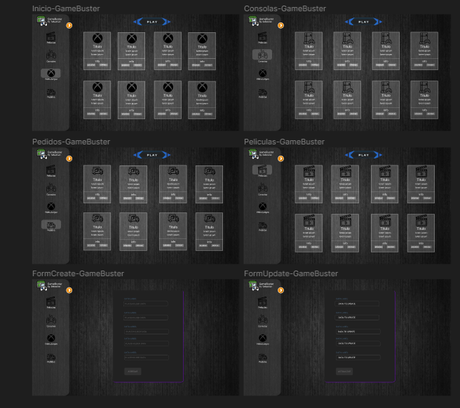

# PRE_FILTRO

## Autor: **Sebastian Daniel Bernal Forero** 

## Link del figma de el proyecto, del diagrama de la base de datos y la ruta del swagger

#### FIGMA

* https://www.figma.com/file/XdKF7efaXMOTr4cT6ZyrsG/Ampliando-Horizontes?type=design&node-id=0-1&mode=design&t=8mZzEN0f4tmYCVIF-0

Lo va a llevar a esta pagina ☝️☝️

Eso es lo que va a mostrar 👇👇



#### DIAGRAMA DE LA DATABASE

* https://lucid.app/lucidchart/743772ae-586f-4141-bfaa-2408b87b6514/edit?viewport_loc=-2288%2C-76%2C2804%2C1206%2C0_0&invitationId=inv_4b0659cc-b79c-4cc4-b423-72a09a86d863

Lo va a llevar a esta pagina ☝️☝️

Eso es lo que va a mostrar 👇👇


#### SWAGGER

1. Primero se tiene que instalar el node_modules del Back

```bash
cd backend
```
```bash
npm i
```

2. Segundo se tiene que ejecutar la api

```bash
npm start
```
Lo va a llevar a esta pagina 👇👇

```bash
http://localhost:4000/api-docs/#/
```


## Planteamiento del proyecto

Este sistema de administracion de blockbuster se creo con la finalidad de ayudar a un establecimineto a llevar el debido control con respeto a su anaquel de productos, usuarios registrados con ellos y sus pedidos, la pagina cuenta con los inventarios de:
* Peliculas: esta mantiene todo con respecto a las peliculas a la venta en la tienda
* Consolas: esta mantiene todo con respecto a las consolas a la venta en la tienda
* Videojuegos: esta mantiene todo con respecto a los videojuegos a la venta en la tienda
* Pedidos: esta mantiene todo con respecto a los pedidos los cuales se hallan hecho desde que se empezo a ussar el sistema para ayudar a llevar control de los mismo
* Nota: la administracion de los clientes solo podra ser ejecutada por personal con conozimiento de la url especifica para evitar que todos los empleados tengan acceso a datos personales de nuestros clientes

## Las anteriores colecciones cuentan con sus debidos CRUDS los cuales dejan:
* GET: obtener información.
* POST: agregar nuevos registros.
* DELETE: eliminar registros existentes.
* PUT: actualizar información existente.

# Espero que cumpla con sus espectativas, Muchas Gracias

* Cualquier duda con respecto al sistema en mi perfil salen mis medios de comunicacion


